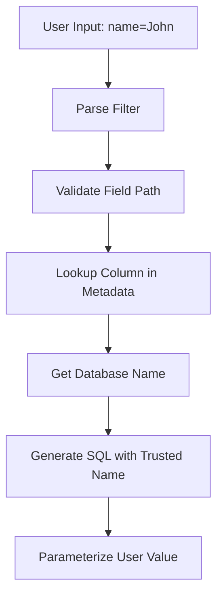

# Security

This document covers the security features of the `aipsql` package, including SQL injection prevention, input validation, and best practices.

## Table of Contents

1. [Security Overview](#security-overview)
2. [SQL Injection Prevention](#sql-injection-prevention)
3. [Input Validation](#input-validation)
4. [Parameterized Queries](#parameterized-queries)
5. [Column Name Safety](#column-name-safety)
6. [Special Character Handling](#special-character-handling)
7. [Security Testing](#security-testing)
8. [Best Practices](#best-practices)

## Security Overview

### Threat Model

The `aipsql` package protects against:

1. **SQL Injection**: Malicious SQL in user input
2. **Column Injection**: Arbitrary column names in queries
3. **Type Confusion**: Mismatched types causing errors
4. **Resource Exhaustion**: Excessive memory/CPU usage

### Defense Strategy

**Layer 1: Input Validation**
- Validate filter/orderBy syntax
- Check column existence
- Verify type compatibility

**Layer 2: Parameterization**
- All user values as parameters
- Never concatenate user input
- Type-safe parameter binding

**Layer 3: Column Name Safety**
- Column names from metadata only
- No user input in column names
- Compile-time constants

**Layer 4: Special Character Escaping**
- LIKE special characters escaped
- No regex injection
- Safe string handling

## SQL Injection Prevention

### Core Principle

**NEVER trust user input in SQL. Always parameterize.**

### Vulnerable Pattern (Never Use)

```go
// ❌ VULNERABLE TO SQL INJECTION
func generateWhereClauseUnsafe(column string, value string) string {
    return fmt.Sprintf("WHERE %s = '%s'", column, value)
}

// Attack: value = "'; DROP TABLE users; --"
// Result: WHERE name = ''; DROP TABLE users; --'
```

### Safe Pattern (Always Use)

```go
// ✅ SAFE WITH PARAMETERIZATION
func generateWhereClauseSafe(column string, value string) (string, Param) {
    paramName := generateParamName()
    sql := fmt.Sprintf("%s = %s", column, paramName)
    param := Param{Name: paramName, Value: value}
    return sql, param
}

// Attack: value = "'; DROP TABLE users; --"
// Result: WHERE name = @p0
// Params: [@p0="'; DROP TABLE users; --"]
// The value is treated as a string, not executed
```

### Implementation in aipsql

All user input is parameterized:

```go
// Input: name:"'; DROP TABLE users; --"
filter, _ := ParseFilter("name:\"'; DROP TABLE users; --\"")

sql, params, _ := table.WhereClause(filter, "p")
// Result: WHERE (name LIKE @p0)
// Params: [@p0='%'; DROP TABLE users; --%']

// The database treats this as a literal string
```

## Input Validation

### Filter Expression Validation

**Syntax Validation**:
```go
filter, err := ParseFilter(userInput)
if err != nil {
    return fmt.Errorf("invalid filter syntax: %w", err)
}
```

**Semantic Validation**:
```go
sql, params, err := table.WhereClauseWithOptions(filter, "p", opts)
if err != nil {
    return fmt.Errorf("filter validation failed: %w", err)
}
```

### Column Existence Check

```go
func (t *Table) FilterableColumnByFieldPath(path FieldPath) (*Column, error) {
    col := t.columnByFieldPath[path.String()]
    if col == nil || !col.filterable {
        validNames := t.validFilterableColumnNames()
        return nil, fmt.Errorf(
            "no filterable field %q, valid fields are %s",
            path.String(),
            strings.Join(validNames, ", "),
        )
    }
    return col, nil
}
```

### Type Validation

**Has Operator Only on STRING**:
```go
func validateHasOperator(column *Column) error {
    if column.columnType != ColumnTypeString {
        return fmt.Errorf(
            "has (:) operator can only be used on STRING columns, field %q has type %s",
            column.fieldPath.String(),
            column.columnType.String(),
        )
    }
    return nil
}
```

**No Has with ArgSubstitute**:
```go
func validateHasOperator(column *Column) error {
    if column.argSubstitute != nil {
        return fmt.Errorf(
            "cannot use has (:) operator on a field that has argSubstitute function",
        )
    }
    return nil
}
```

### SQL Dialect Validation

```go
func validateDialect(dialect string) error {
    switch strings.ToLower(dialect) {
    case "", "generic", "postgres", "mysql":
        return nil
    default:
        return fmt.Errorf(
            "invalid SQL dialect %q, supported values are %q, %q and %q",
            dialect,
            SQLDialectGeneric,
            SQLDialectPostgres,
            SQLDialectMySQL,
        )
    }
}
```

### Match Mode Validation

```go
func validateMatchMode(mode MatchMode) error {
    switch mode {
    case MatchModeExact, MatchModePrefix, MatchModeFullText, MatchModeContains:
        return nil
    default:
        return fmt.Errorf(
            "invalid match mode %q, valid match modes are %q, %q, %q and %q",
            mode,
            MatchModeExact,
            MatchModePrefix,
            MatchModeFullText,
            MatchModeContains,
        )
    }
}
```

## Parameterized Queries

### QueryParameter Structure

```go
type Param struct {
    Name  string      // Parameter name (e.g., "@p0")
    Value interface{} // Parameter value (type-safe)
}
```

### Parameter Naming

**Regular Parameters**:
```go
@p0, @p1, @p2, ...
```

**Seek Equality Parameters**:
```go
@seek_eq_0, @seek_eq_1, ...
```

**Seek Comparison Parameters**:
```go
@seek_cmp_0, @seek_cmp_1, ...
```

**Key-Value Parameters**:
```go
@kv_key_1, @kv_value_1, ...
```

### Type-Safe Binding

```go
func bindParam(db *sql.DB, sql string, params []Param) (*sql.Rows, error) {
    args := make([]interface{}, len(params))
    for i, p := range params {
        args[i] = p.Value  // Type preserved
    }
    return db.Query(sql, args...)
}
```

### Example: All Values Parameterized

```go
// Input
filter := "status=\"active\" AND name:\"John\" AND created_at>\"2024-01-01\""

// Generated SQL
sql := "((status = @p0) AND (name LIKE @p1) AND (created_at > @p2))"

// Parameters
params := []Param{
    {Name: "@p0", Value: "active"},
    {Name: "@p1", Value: "John%"},
    {Name: "@p2", Value: "2024-01-01"},
}

// Execute (safe)
rows, err := db.Query(sql, paramValues(params)...)
```

## Column Name Safety

### Principle

**Column names NEVER come from user input.**

### Table Metadata Only

```go
// Column definitions at compile time
table := aipsql.NewTable().WithColumns(
    aipsql.NewColumn().
        WithFieldPath("name").      // API field (validated)
        WithDatabaseName("name").   // DB column (trusted constant)
        Filterable().
        Build(),
).Build()

// User input references field path
filter := "name:\"John\""

// Column name from metadata
col := table.columnByFieldPath["name"]
dbName := col.DatabaseName  // "name" - trusted!
```

### No User Column Names

```go
// ❌ NEVER DO THIS
columnName := r.URL.Query().Get("column")  // User input!
sql := fmt.Sprintf("ORDER BY %s", columnName)  // SQL injection!

// ✅ ALWAYS DO THIS
orderBy, _ := ParseOrderBy(userInput)
sql, _, _ := table.OrderByClause(orderBy, "p")  // Safe!
```

### Validation Flow



## Special Character Handling

### LIKE Special Characters

**Characters to Escape**: `%`, `_`, `\`

**Why**: These have special meaning in LIKE patterns.

**Escape Function**:

```go
func escapeLikeValue(value string) string {
    value = strings.ReplaceAll(value, "\\", "\\\\")  // Backslash first!
    value = strings.ReplaceAll(value, "%", "\\%")
    value = strings.ReplaceAll(value, "_", "\\_")
    return value
}
```

**Example**:

```go
// Input: "100%"
filter := "discount:\"100%\""

// Escaped value: "100\%"
sql := "discount LIKE @p0"
params := []Param{{Name: "@p0", Value: "100\\%"}}

// Database searches for literal "100%", not "100" wildcard
```

### String Literal Safety

**No Direct String Interpolation**:

```go
// ❌ DANGEROUS
sql := fmt.Sprintf("name = '%s'", userInput)

// ✅ SAFE
param := Param{Name: "@p0", Value: userInput}
sql := "name = @p0"
```

### Boolean Handling

**Validated Boolean Literals**:

```go
func processBoolValue(value string) (string, error) {
    switch strings.ToUpper(value) {
    case "TRUE", "1":
        return "TRUE", nil
    case "FALSE", "0":
        return "FALSE", nil
    default:
        return "", fmt.Errorf("invalid boolean value: %s", value)
    }
}
```

## Security Testing

### Unit Tests

```go
func TestSQLInjectionPrevention(t *testing.T) {
    table := setupTestTable()

    maliciousInputs := []string{
        "'; DROP TABLE users; --",
        "' OR '1'='1",
        "admin'--",
        "' UNION SELECT * FROM passwords--",
    }

    for _, input := range maliciousInputs {
        filter, _ := ParseFilter(fmt.Sprintf("name:\"%s\"", input))

        sql, params, _ := table.WhereClause(filter, "p")

        // Verify malicious input not in SQL
        assert.NotContains(t, sql, "DROP TABLE")
        assert.NotContains(t, sql, "UNION SELECT")

        // Verify input in parameters
        assert.Contains(t, paramValues(params), input)
    }
}
```

### Property-Based Tests

```go
func TestProperty_AllUserInputParameterized(t *testing.T) {
    property := func(filter string) bool {
        sql, params, err := table.WhereClauseWithOptions(filter, opts)
        if err != nil {
            return true  // Errors are OK
        }

        // All values should be in parameters
        return allInputInParameters(filter, params)
    }

    quick.Check(property, &quick.Config{MaxCount: 1000})
}
```

### Fuzz Testing

```go
func FuzzFilterParser(f *testing.F) {
    f.Add("name:\"test\"")
    f.Add("status=\"active\"")

    f.Fuzz(func(t *testing.T, input string) {
        filter, err := ParseFilter(input)
        if err != nil {
            return  // Parse errors are OK
        }

        // Should not panic
        sql, params, err := table.WhereClause(filter, "p")
        _ = sql
        _ = params
        _ = err
    })
}
```

### Integration Tests

```go
func TestSQLInjectionInDatabase(t *testing.T) {
    db := setupTestDB(t)
    table := setupTestTable()

    // Attempt injection
    filter, _ := ParseFilter("name:\"'; DROP TABLE users; --\"")
    sql, params, _ := table.WhereClause(filter, "p")

    // Execute
    _, err := db.Exec(sql, paramValues(params)...)

    // Verify table still exists
    var exists bool
    db.QueryRow("SELECT EXISTS(SELECT 1 FROM users)").Scan(&exists)
    assert.True(t, exists, "Table should still exist")
}
```

## Best Practices

### 1. Always Use Parameterized Queries

```go
// ✅ GOOD
sql, params, _ := table.WhereClause(filter, "p")
db.Query(sql, paramValues(params)...)

// ❌ BAD
sql = fmt.Sprintf("WHERE name = '%s'", userInput)
db.Query(sql)
```

### 2. Validate Input Early

```go
// ✅ GOOD
filter, err := ParseFilter(userInput)
if err != nil {
    return fmt.Errorf("invalid filter: %w", err)
}

sql, params, err := table.WhereClauseWithOptions(filter, "p", opts)
if err != nil {
    return fmt.Errorf("invalid query: %w", err)
}

// ❌ BAD
filter, _ := ParseFilter(userInput)  // Ignore errors
```

### 3. Use Strict Mode in Production

```go
opts := aipsql.WhereClauseOptions{
    Dialect:    aipsql.SQLDialectPostgres,
    StrictMode: true,  // Fail on unsupported features
}
```

### 4. Never Concatenate User Input

```go
// ✅ GOOD
orderBy, _ := ParseOrderBy(userInput)
sql, _, _ := table.OrderByClause(orderBy, "p")

// ❌ BAD
sql := "ORDER BY " + userInput  // SQL injection!
```

### 5. Enable Logging for Security Events

```go
if detectSuspiciousInput(userInput) {
    log.Warn("Suspicious input detected",
        "input", userInput,
        "source", "filter_expression",
        "timestamp", time.Now(),
    )
}
```

### 6. Use Prepared Statements

```go
// ✅ GOOD
stmt, err := db.Prepare("SELECT * FROM users WHERE " + sql)
if err != nil {
    return err
}
defer stmt.Close()

rows, err := stmt.Query(paramValues(params)...)

// ❌ BAD (but still parameterized)
rows, err := db.Query("SELECT * FROM users WHERE "+sql, paramValues(params)...)
```

### 7. Validate Page Tokens

```go
token, err := aipsql.ParseSeekPageToken(userToken)
if err != nil {
    return fmt.Errorf("invalid page token: %w", err)
}

// Additional validation
if len(token.SortValues) != len(orderByFields) {
    return fmt.Errorf("token field count mismatch")
}
```

## Security Checklist

Use this checklist to review your code:

- [ ] All user input is parameterized
- [ ] Column names from metadata only
- [ ] Input validation enabled
- [ ] LIKE special characters escaped
- [ ] Strict mode enabled in production
- [ ] Error handling doesn't expose details
- [ ] Prepared statements used
- [ ] Page tokens validated
- [ ] Security tests in place
- [ ] Dependency vulnerabilities scanned

## Summary

The `aipsql` package provides multiple layers of security:

1. **Parameterized Queries**: All user values bound as parameters
2. **Column Name Safety**: Column names from trusted metadata
3. **Input Validation**: Syntax and semantic validation
4. **Special Character Escaping**: LIKE patterns escaped
5. **Type Safety**: Type-compatible operations only

**Remember**: Security is a process, not a product. Always:
- Review code for vulnerabilities
- Keep dependencies updated
- Monitor for security issues
- Test security properties
- Follow security best practices
